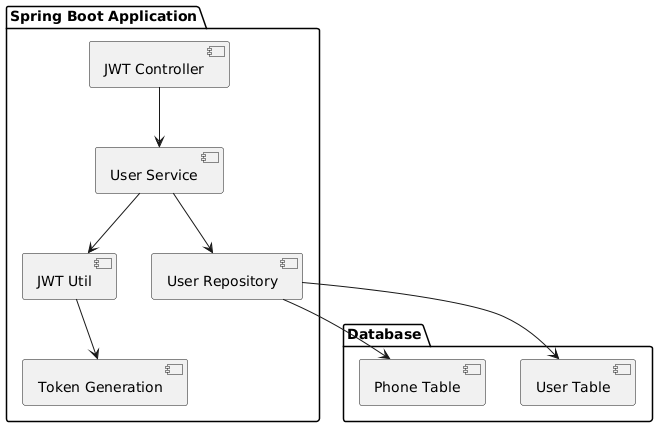
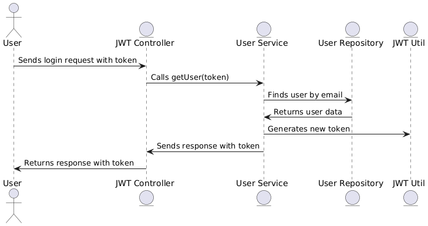

# JWT Authentication System

This project implements an authentication system using JSON Web Tokens (JWT) in a Spring Boot application. The application enables user creation, authentication, and session token management.

## Requirements

Before starting, ensure you have the following installed on your machine:

- [Java 11](https://adoptopenjdk.net/) or higher
- [Maven](https://maven.apache.org/) for dependency management and build
- [Spring Boot](https://spring.io/projects/spring-boot) (used as the framework)
- [Git](https://git-scm.com/) for source code management

## Installation

### 1. Cloning the Repository

First, clone this repository to your local machine:

```bash
git clone https://github.com/your_username/jwt-authentication-system.git
```

### 2. Build the Project

After cloning the repository, navigate to the project directory and execute the following command to build the project using Maven:

```bash
mvn clean install
```

This command will download all necessary dependencies and package the application.

### 3. Execution

To run the application, use the following command:

```bash
mvn spring-boot:run
```

### 4. Endpoints

#### POST /sign-up

Sign up a new user. Requires a JSON body with the user's name, email, password, and phones.

Example request body:

```json
{
  "name": "Juan Pérez",
  "email": "juan.perez@example.com",
  "password": "password123",
  "phones": [
    {
      "number": "123456789",
      "citycode": "1",
      "countrycode": "52"
    }
  ]
}
```

#### POST /login

Authenticate a user. Requires an Authorization header with a valid Bearer token.

Example request using `curl`:

```bash
curl -X POST http://localhost:8080/login -H "Authorization: Bearer <your-token>"
```

### 5. UML Diagrams

#### Component Diagram



#### Sequence Diagram



